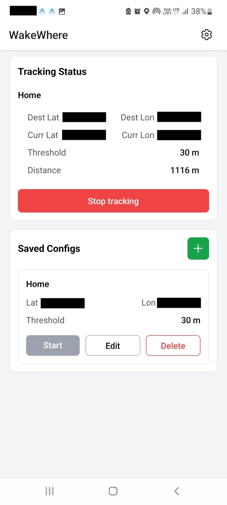
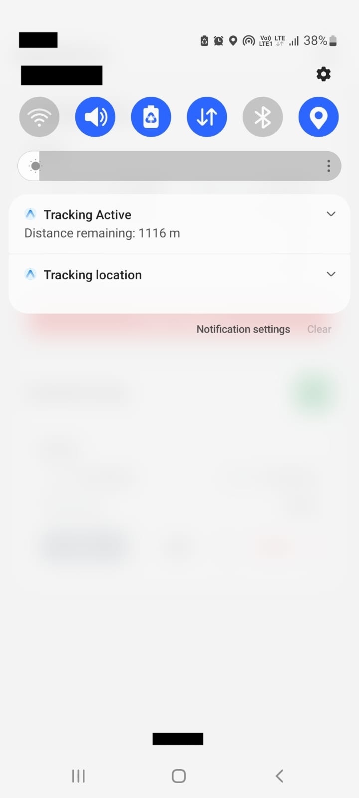
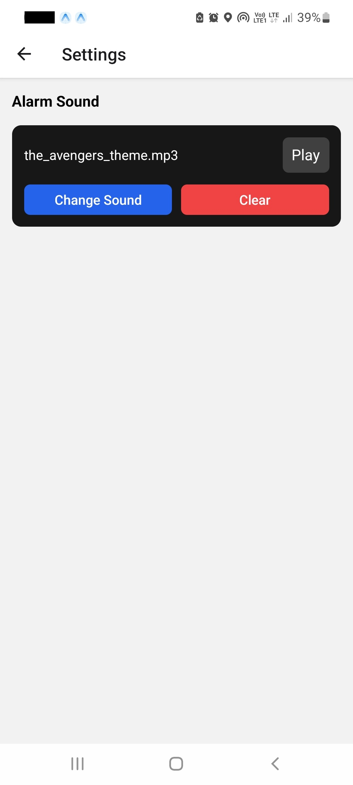
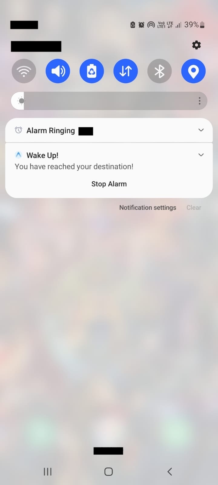

# WakeWhere

WakeWhere is a location-based alarm application built using **React Native (Expo)** with **native Android integration**.  
It automatically triggers an alarm when the user reaches a specified destination.

---

## Overview

WakeWhere is designed to solve a common real-world problem: ensuring that a user is alerted when they reach a destination, even if the app is in the background or the device is locked.

WakeWhere uses a hybrid approach:
- JavaScript (Expo) for tracking, state, and UI
- Native Android code for reliable alarm 

The app is designed to be **fully offline-first**:
- Location tracking and alarm triggering work without internet
- Internet is only required for map-based location selection

WakeWhere also ensures **transparent location usage** by maintaining a notification while tracking is active.

---

## Features

- Destination-based alarm triggering
- Background location tracking
- Real-time distance notification
- Custom alarm sound selection
- Looping alarm playback
- Notification-based stop control

---

## Screenshots

### Tracking

<p align="center">
  
  
</p>

<p align="center">
  <sub>Tracking (in app) &nbsp;&nbsp;&nbsp;&nbsp;&nbsp;&nbsp;&nbsp;&nbsp; Tracking (notification)</sub>
</p>

---

### Alarm

<p align="center">
  
  
</p>

<p align="center">
  <sub>Alarm Sound Selection &nbsp;&nbsp;&nbsp;&nbsp;&nbsp;&nbsp;&nbsp;&nbsp; Alarm Notification</sub>
</p>

<p align="center">
  
</p>

<p align="center">
  <sub>Alarm Notification (in background)</sub>
</p>

---

## Architecture

WakeWhere uses a two-layer architecture:

### Expo / React Native Layer

Handles:
- Location tracking (`expo-location`, `TaskManager`)
- State management (alarm state machine)
- Notifications (`Notifee`)
- Storage (`AsyncStorage`)
- UI

Alarm state machine:
idle → tracking → triggered → ringing → stopped

---

### Native Android Layer

Handles:
- Foreground service lifecycle
- Audio playback using `MediaPlayer`
- React Native - Android bridge
- Native setup via **Expo config plugins**

Core components:
- `AlarmService.kt`
- `AlarmModule.kt`
- `AlarmPackage.kt`

---

## Tech Stack

| Category           | Tools / Technologies |
|--------------------|--------------------|
| Framework          | React Native (Expo) |
| Language           | TypeScript |
| Styling            | NativeWind |
| Storage            | AsyncStorage |
| Location & Tracking| Expo Location, TaskManager |
| Notifications      | Notifee |
| Maps               | Leaflet (WebView) |
| Audio              | Android MediaPlayer |
| Native Layer       | Kotlin + Expo Config Plugins |
| Build & Deployment | EAS |

---

## Why Native for Alarm Playback?

React Native (and expo) alone cannot reliably support:

- Guaranteed execution when the app is closed  
- Persistent, looping audio playback  
- Foreground service behavior  

On Android (especially Android 12+), strict background restrictions prevent reliable alarm behavior using JavaScript alone.

Using a native foreground service with `MediaPlayer` ensures:
- Continuous playback  
- System-level reliability  
- Proper alarm-like behavior  

---

## Installation

# Prerequisites

- Node.js (>= 18 recommended)
- npm or yarn
- Android device or emulator
- EAS CLI

Install EAS CLI:

`npm install -g eas-cli`

The following commands will clone the repository, install dependencies, and build an installable Android APK using EAS:

```bash
git clone https://github.com/GMHarish285/WakeWhere.git
cd WakeWhere
npm install
npx eas build -p android --profile preview
```

---

## Future Improvements

- Snooze functionality
- Full-screen alarm UI
- Optional iOS adaptation (best-effort approach)